IaaS-Monitoring-v1.0 
===================

   

## Prerequisites

> **IaaS-Monitoring에는 선행작업(Prerequisites)으로 Monasca Server 및 Monasca Client가 설치되어 있어야 합니다. (※ 문서는 Ubuntu 기준으로 작성되어 있습니다.)**

#### [Monasca - Server](./src/openstack-monitoring-portal/doc-api/설치가이드_Monasca_Server.md)

#### [Monasca - Client](./src/openstack-monitoring-portal/doc-api/설치가이드_Monasca_Client.md)

 

   

1. [개요](#1)
    * [문서 개요](#2)  
        * [목적](#3)
        * [범위](#4)
        * [참고자료](#5)

2. [IaaS Monitoring 애플리케이션 환결설정](#6)
    * [개요](#7)
	* [개발환경 구성](#8)
	    * [Git 설치](#9)
        * [IntelliJ IDEA설치](#10)
        * [Go Lang설치](#11)
        * [Go 애플리케이션 환경설정](#12)
    * [소스 다운로드](#13)
	* [IaaS Monitoring 애플리케이션 선행조건](#14)
        * [IaaS-Monitoring 프로젝트 Open](#15)
        * [Dependencies Module Download](#16)
            * [IaaS Monitoring Dependency Download](#17)
        * [Front-end 환경설정 (Windows)](#18)
            * [npm Install](#19)
            * [bower Install](#20)
            * [Front-end Dependencies Module Download](#21)
            * [Gulp Install](#22)
            * [Building 및 Web Server 기동](#23)
        * [Front-end 환경설정 (Ubuntu)](#24)
            * [npm Install](#25)
            * [bower Install](#26)
            * [Building 및 Web Server 기동](#27)
            
3. [3.	IaaS 모니터링 애플리케이션 구성](#28)
    * [관련 Table 목록](#29)
    * [IaaS-Monitoring 구조](#30)
    * [IaaS-Monitoring Component](#31)
    * [IaaS-Monitoring 설정정보](#32)
    * [IaaS-Monitoring Package 구조](#33)
    * [IaaS-Monitoring Package간 호출 구조](#34)
    * [IaaS-Monitoring 화면](#35)
        * [Login 화면](#36)
        * [Main 화면](#37)
        * [Manage Node Summary 화면](#38)
        * [Manage Node 상세화면](#39)
        * [Compute Node Summary](#40)
        * [Tenant Summary](#41)
        * [VM 상세 화면](#42)
        * [Alram Notification](#43)
        * [Alram Definition](#44)
        * [Alram Definition 생성](#45)
        * [Alram Status 조회](#46)
        
    

#   1. 개요 

##  1.1. 문서개요 

 

### 1.1.1. 목적 

> 본 문서는 Paas-TA 프로젝트의 IaaS Monitoring 애플리케이션을 개발 및 배포하는 방법에 대해 제시하는 문서이다.

 

###  1.1.2. 범위 

> 본 문서의 범위는 IaaS(Openstack) 시스템 상태를 조회하고, 임계치 정보와의 비교를 통해 관리자에게 관련 정보를 전달하는 방법에 대한 내용으로 한정되어 있다.

 

### 1.1.3. 참고자료 

- https://golang.org/
- https://git-scm.com
- https://github.com/tedsuo/ifrit
- https://github.com/tedsuo/rata
- https://github.com/influxdata/influxdb/client/v2
- https://github.com/rackspace/gophercloud
- https://github.com/go-sql-driver/mysql
- https://github.com/jinzhu/gorm
- https://github.com/cihub/seelog
- https://github.com/monasca/golang-monascaclient/monascaclient
- https://github.com/gophercloud/gophercloud/
- https://github.com/alexedwards/scs
- https://gopkg.in/olivere/elastic.v3
- https://github.com/onsi/ginkgo
- https://github.com/onsi/gomega
- https://github.com/stretchr/testify

  

#   2. IaaS Monitoring 애플리케이션 환경 설정 

##  2.1. 개요 

> 개방형 플랫폼 프로젝트의 모니터링 시스템에서 IaaS(Openstack)시스템의 상태를 조회하여, 사전에 설정한 임계치 값과 비교 후, 초과된 시스템 자원을 사용중인 서비스들의 목록을 관리자에게 통보하기 위한 애플리케이션 개발하고, 배포하는 방법을 설명한다.

 

##  2.2. 개발환경 구성 

> 애플리케이션 개발을 위해 다음과 같은 환경으로 개발환경을 구성 한다.

    - OS : Window/Ubuntu
    - Golang : 1.8.3
    - Dependencies :  github.com/tedsuo/ifrit
                      github.com/tedsuo/rata
                      github.com/influxdata/influxdb/client/v2
                      github.com/rackspace/gophercloud
                      github.com/go-sql-driver/mysql
                      github.com/jinzhu/gorm
                      github.com/cihub/seelog
                      github.com/monasca/golang-monascaclient/monascaclient
                      github.com/gophercloud/gophercloud/
                      github.com/alexedwards/scs
                      gopkg.in/olivere/elastic.v3
                      github.com/onsi/ginkgo
                      github.com/onsi/gomega
                      github.com/stretchr/testify
    - IDE : Intellij IDEA 2017.
    - 형상관리: Git

> ※	Intellij IDEA 는 Commnuity와 Ultimate 버전이 있는데, Community 버전은 Free이고, Ultimate 버전은 은 30-day trial버전이다

 

###  2.2.1.	Git 설치 

> 아래 URL에서 자신에 OS에 맞는 Git client를 다운로드 받아 설치 한다.
    
    https://git-scm.com/downloads

 

###  2.2.2.	Golang 설치 

> 아래 URL에서 자신에 OS에 맞는 go SDK를 다운로드 받아 설치 한다. (1.8 이상)

    https://golang.org/dl

> GOROOT, 및 PATH를 설정한다.

 

###  2.2.3.	IntelliJ IDEA설치 

> **IDEA 다운로드**

    https://www.jetbrains.com/idea/?fromMenu

&nbsp;&nbsp;&nbsp; 
&nbsp;&nbsp;&nbsp; 
&nbsp;&nbsp;&nbsp; 

 

> **IntelliJ IDEA 설치**

idealC-2017.2.5.exe 더블클릭하여 설치를 실행한다.

 

&nbsp;&nbsp;&nbsp; 

- 'Next' 버튼 클릭

 

&nbsp;&nbsp;&nbsp; 

- 설치위치 지정 후 'Next' 버튼 클릭

 

&nbsp;&nbsp;&nbsp; 

- 'Next' 버튼 클릭

 

&nbsp;&nbsp;&nbsp; 

- 'Install' 버튼 클릭

 

&nbsp;&nbsp;&nbsp; 

&nbsp;&nbsp;&nbsp; 

- Run IntelliJ IDEA Community Edition” 체크 선택
- 'Finish' 버튼 클릭

 

###  2.2.4.	Go 애플리케이션 환경설정 

> 만약, Go SDK 설정이 되어 있지 않을 경우, 아래 절차를 통해 SDK를 등록한다.

 

&nbsp;&nbsp;&nbsp; 

- 화면상단 메뉴에서 File > Setting 을 클릭한다.

 

&nbsp;&nbsp;&nbsp; 

- 왼쪽 메뉴에서 "Plugin"을 선택 후, "Browse repositories" 버튼을 클릭한다.

 

&nbsp;&nbsp;&nbsp; 

- 검색어 입력란에 "Go"  입력 후, 조회된 결과에서 "Go"를 선택한 뒤, "Install" 버튼을 클릭한다.

 

&nbsp;&nbsp;&nbsp; 

- "Restart IntelliJ IDEA" 선택
- IntellJ를 재시작 한다.

 

##   2.3. 소스 다운로드 

> IaaS 소스를 다운로드 받는다.
    
    $ cd workspace
    $ git clone https://github.com/PaaS-TA/IaaS-Monitoring

 

##   2.4. IaaS Monitoring 어플리케이션 선행조건 

> IaaS 모니터링은 Openstack, Monasca 기반으로 제작 되어있다. 
> Monasca agent가 Openstack에 설치 되어 있으며, Monasca가 설치 되어 있는 것을 전재로 본 어플리케이션이 실행가능하다.
> Monasca 및 Monasca Agent설치는 monasca_server/client 설치 가이드를 참조하기 바란다.

 

###  2.4.1.	IaaS-Monitoring 프로젝트 Open 

&nbsp;&nbsp;&nbsp; 

- IntellJ 실행 후 "Open" 을 선택한다.

 

&nbsp;&nbsp;&nbsp; 

- 화면상단 메뉴에서 File > Open 을 클릭한다.

 

&nbsp;&nbsp;&nbsp; 

- "Languages & Frameworks" 를 클릭한다.
- "Go"를 클릭한다

 

&nbsp;&nbsp;&nbsp; 

&nbsp;&nbsp;&nbsp; 

- "GOROOT" 를 클릭한다. SDK를 아래와 같이 선택한다. 

- (※ GO Lang의 버전은 1.8 이상 설치)

 

&nbsp;&nbsp;&nbsp; 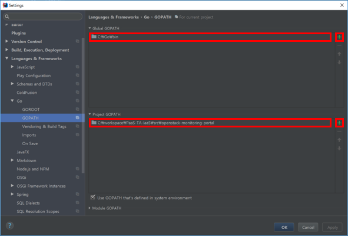

- Global GOPATH 우측 + 버튼을 클릭하여 "C:\Go\bin" 설정한다. 
- Project GOPATH 우측 + 버튼을 클릭하여 "\…\IaaS-Monitoring\src\openstack-monitoring-portal" 로 설정한다.
- IntellJ 를 재시작한다.

  

###  2.4.2.	Dependencies Module Download 

#### 2.4.2.1. IaaS Monitoring Dependency Download 

> Dos 창을 오픈한다.

    $ cd \IaaS-Monitoring\src\openstack-monitoring-portal
    $ set GOPATH='현재 디렉토리 경로"
    $ set PATH=%PATH%;%GOPATH%bin;

 

> 입력창에 아래와 같이 입력한다.

    go get github.com/tedsuo/ifrit
    go get github.com/tedsuo/rata
    go get github.com/influxdata/influxdb/client/v2
    go get github.com/rackspace/gophercloud
    go get github.com/go-sql-driver/mysql
    go get github.com/jinzhu/gorm
    go get github.com/cihub/seelog
    go get github.com/monasca/golang-monascaclient/monascaclient
    go get github.com/gophercloud/gophercloud/
    go get github.com/alexedwards/scs
    go get gopkg.in/olivere/elastic.v3
    go get github.com/onsi/ginkgo
    github.com/onsi/gomega
    github.com/stretchr/testify

 

> src 디렉토리에 Dependencies 소스들이 다운로드 되어 있음을 확인한다.

&nbsp;&nbsp;&nbsp; 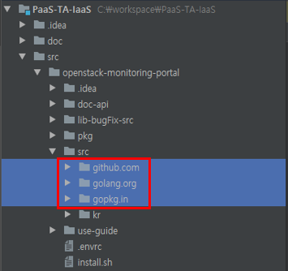

 

> Dependency를 모두 다운 받은 후 다음을 실행한다.

    $cp ./lib-bugFix-src/alarm_definitions.go ./src/github.com/monasca/golang-monascaclient/ monascaclient
    $cp ./lib-bugFix-src/notifications.go ./src/github.com/monasca/golang-monascaclient/ monascaclient
    $cp ./lib-bugFix-src/alarms.go ./src/github.com/monasca/golang-monascaclient/monascaclient

 

###  2.4.3.	Front-end 환경설정 (Windows) 

#### 2.4.3.1. npm Install 

> **Node.js 다운로드 및 설치**

    https://nodejs.org/en/

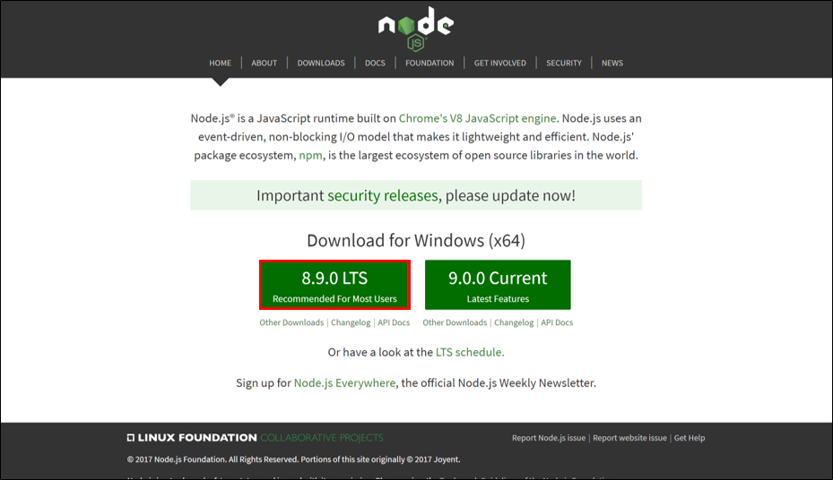

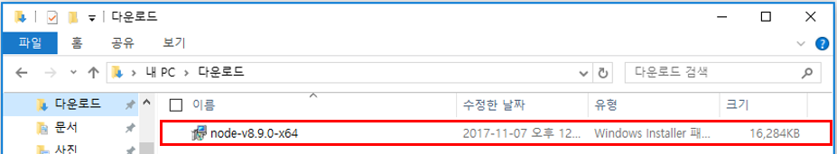

 

> "node-v8.9.0-x64.exe" 파일 실행한다.

&nbsp;&nbsp;&nbsp; 

- "Next" 버튼을 클릭한다.

 

&nbsp;&nbsp;&nbsp; 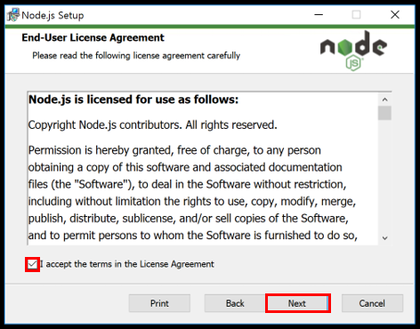

- "I accept the terms in the License Agreement" 를 선택 후 "Next" 버튼을 클릭한다.

 

&nbsp;&nbsp;&nbsp; 

- 설치할 경로를 지정 후 "Next" 버튼을 클릭한다.

 

&nbsp;&nbsp;&nbsp; 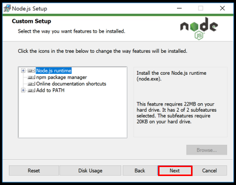

- "Next" 버튼을 클릭한다.

 

&nbsp;&nbsp;&nbsp; 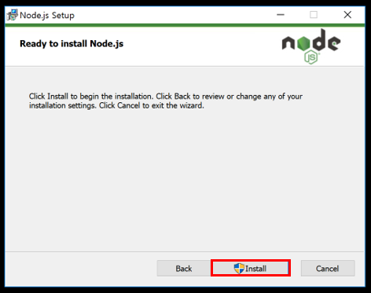

- "Install" 버튼을 클릭한다.

 

&nbsp;&nbsp;&nbsp; 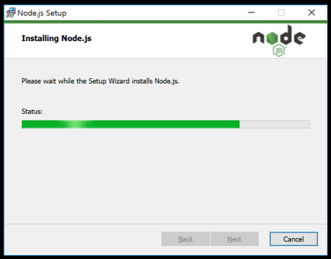

&nbsp;&nbsp;&nbsp; 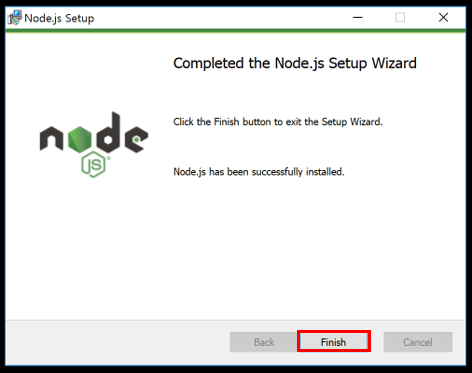

- "Finish" 버튼을 클릭한다.

 

> **Node.js 설치 확인**

    C:\> npm -v

- 위 명령어를 cmd 창에서 실행 할 경우 하단에 설치된 버전(“5.5.1”)이 나타나다.
- 나타나지 않을 경우 설치가 잘못된 경우로 재설치한다.

 

#### 2.4.3.2.	Bower Install 

> **Bower 설치**

    C:\> npm install –g bower
    
- "npm install –g bower" 명령어로 bower 설치한다.

 

#### 2.4.3.3.	Front-end Dependencies Module Download 

    C:\> cd \…\PaaS-TA-IaaS\src\openstack-monitoring-portal\src\kr\paasta\monitoring \openstack\public
    
- "\PaaS-TA-IaaS\src\openstack-monitoring-portal\src\kr\paasta\monitoring \openstack\public" 경로로 이동한다.

 

    C:\...\PaaS-TA-IaaS\src\openstack-monitoring-portal\src\kr\paasta\monitoring \openstack\public> bower install

- "bower install" 명령어로 Dependenceis module을 다운로드한다.

 

&nbsp;&nbsp;&nbsp; 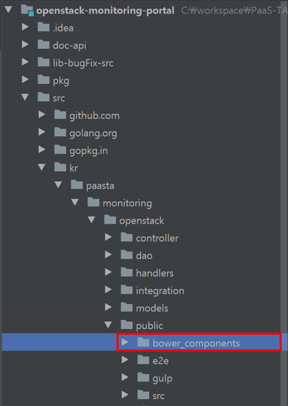

- public 디렉토리에 Dependencies 소스들이 다운로드 되어 있음을 확인한다.

 

#### 2.4.3.4. Gulp Install  

> **Gulp 전역 설치**

    C:\> npm install –g gulp 

- "npm install –g gulp" 명령어로 gulp 설치한다.

 

> **Gulp 설치**

    C:\> cd \…\PaaS-TA-IaaS\src\openstack-monitoring-portal\src\kr\paasta\monitoring \openstack\public

- "\PaaS-TA-IaaS\src\openstack-monitoring-portal\src\kr\paasta\monitoring \openstack\public" 경로로 이동한다.

    C:\...\PaaS-TA-IaaS\src\openstack-monitoring-portal\src\kr \paasta\monitoring\openstack\public> npm install gulp

- "npm install gulp" 명령어로 gulp를 설치한다.

 

#### 2.4.3.5. Building 및 Web Server 기동 

> **Building**

    C:\> cd \…\PaaS-TA-IaaS\src\openstack-monitoring-portal\src\kr\paasta\monitoring \openstack\public

- "\PaaS-TA-IaaS\src\openstack-monitoring-portal\src\kr\paasta\monitoring \openstack\public" 경로로 이동한다.

    C:\...\PaaS-TA-IaaS\src\openstack-monitoring-portal\src\kr \paasta\monitoring\openstack\public> gulp package

- "gulp package" 명령어로 gulp를 통해 소스를 빌드한다.

 

&nbsp;&nbsp;&nbsp; 

- public 디렉토리에 dist폴더에 빌드된 소스들이 생성된다

 

> **Web Server 기동**

    C:\...\PaaS-TA-IaaS\src\openstack-monitoring-portal\src\kr \paasta\monitoring\openstack\public> gulp serve

- "gulp serve" 명령어로 Web Server를 실행한다.

&nbsp;&nbsp;&nbsp; 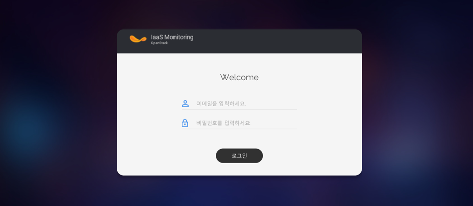

 

###  2.4.4.	Front-end 환경설정 (Ubuntu) 

#### 2.4.4.1. npm Install 

    user@user-com:~$ cd ~/…/IaaS-Monitoring/src/openstack-monitoring-portal/src/kr /pasta/monitoring/openstack/public

- "/…/IaaS-Monitoring/src/openstack-monitoring-portal/src/kr /pasta/monitoring/openstack/public" 경로로 이동한다.

 

    user@user-com: ~/…/IaaS-Monitoring/src/openstack-monitoring-portal/src/kr/pasta /monitoring/openstack/public $ npm install

- "npm install" 명령어로 npm을 설치한다.

 

 
#### 2.4.4.2. Bower Install 

    user@user-com:~$ cd ~/…/IaaS-Monitoring/src/openstack-monitoring-portal/src/kr /pasta/monitoring/openstack/public

- "/…/IaaS-Monitoring/src/openstack-monitoring-portal/src/kr /pasta/monitoring/openstack/public" 경로로 이동한다.

 

    user@user-com: ~/…/IaaS-Monitoring/src/openstack-monitoring-portal/src/kr/pasta /monitoring/openstack/public$ npm install

- "bower install" 명령어로 bower을 설치한다.

 

##### 2.4.4.3. Building 및 Web Server 기동 

> **Building**

    user@user-com:~$ cd ~/…/IaaS-Monitoring/src/openstack-monitoring-portal/src/kr /pasta/monitoring/openstack/public

- "\PaaS-TA-IaaS\src\openstack-monitoring-portal\src\kr\paasta\monitoring \openstack\public" 경로로 이동한다.

    user@user-com: ~/…/IaaS-Monitoring/src/openstack-monitoring-portal/src/kr/pasta /monitoring/openstack/public$ gulp package

- "gulp package" 명령어로 gulp를 통해 소스를 빌드한다.

 

> **Web Server 기동**

    user@user-com: ~/…/IaaS-Monitoring/src/openstack-monitoring-portal/src/kr/pasta /monitoring/openstack/public$ gulp serve

- "gulp serve" 명령어로 Web Server를 실행한다.

  

#    3. IaaS 모니터링 애플리케이션 구성 

> IaaS 모니터링 Application은 Openstack, Monasca 기반으로 구성되어 있다. Openstack Node에 monasca Agent가 설치되어 metric data를 monasca에 전송해준다. IaaS 모니터링은 Openstack, Monasca와 연동하여 Application을 기동한다. 사용자 계정은 Openstack 관리자 권한 사용자만 IaaS Monitoring에 로그인 가능하다.

 

##  3.1. 관련 Table 목록  

> IaaS 모니터링은 기본적으로 Monasca의 DB정보를 사용한다. 이외에 Openstack에 필요

 

**Monitoring DB**

<table>
    <tr>
        <th>Table 명</th>
        <th>설명</th>
    </tr>
    <tr>
        <td>alarms</td>
        <td>Alarm_definition 과 notification_method의 매핑 Table로 Alarm 발생시 Action 을 정의 한다.</td>
    </tr>
    <tr>
        <td>alarm_definition</td>
        <td>Alarm 임계치를 정의 한다. Expression 은 sub_alarm_definition에 저장된다.</td>
    </tr>
    <tr>
        <td>alarm_definition_serverity</td>
        <td>Alarm 심각도를 정의하는 table로 초기 Data (CRITICAL,HIGH,LOW,MEDIUM) 가 있다.</td>        
    </tr>
    <tr>
        <td>sub_alarm_definition</td>
        <td>Alarm_definition에서 expression에 조건 만큼 Data존재한다.</td>
    </tr>
    <tr>
        <td>sub_alarm_definition_dimension</td>
        <td>Sub Alarm의 조회 field를 정의한다.</td>
    </tr>
    <tr>
        <td>alarm_metric</td>
        <td>Alarm metric정보가 저장된다.</td>
    </tr>
    <tr>
        <td>alarm_state</td>
        <td>Alarm state를 정의하는 table로 초기 Data(ALARM, OK, UNDETERMINED) 가 있다.</td>
    </tr>
    <tr>
        <td>metric_definition</td>
        <td>metric정의</td>
    </tr>
    <tr>
        <td>metric_definition_dimensions</td>
        <td>Metric measurement의 field정의가 있다.</td>
    </tr>
    <tr>
        <td>notification_method</td>
        <td>alarm 대상별 Alarm전송방식정보가 저장되어 있다.</td>
    </tr>
    <tr>
        <td>notification_method_type</td>
        <td>Alarm을 알릴 방식을 정의한다. Email, webhook등이 있다.</td>
    </tr>
    <tr>
        <td>alarms</td>
        <td>ThresholdEngine에서 alarm_definition에서 정의한 임계치 위배시 alarm 발생</td>
    </tr>
    <tr>
        <td>Sub_alarm</td>
        <td>Alarm 발생시 alarm_definition에서 어떤 expression에서 임계치가 위배 되었는지 정보가 있다. ThresholdEngine에서 생성</td>
    </tr>
    <tr>
        <td>Alarm_action_histories</td>
        <td>알람 조치 내역을 입력한다. IaaS Monitoring 에서 Table을 생성하고 관리한다.</td>
    </tr>
</table>

 

##  3.2. IaaS Monitoring 구조  

> 다음 그림은 IaaS 모니터링의 좀더 상세한 구조를 보여준다.  IaaS Monitoring은 Openstack, metricDB, configDB와 연계하여 시스템의 상태 및 알람설정 및 처리 이력등을 보여준다.

 

##  3.3. IaaS Monitoring Component  

<table>
    <tr>
        <th>Component</th>
        <th>설명</th>
    </tr>
    <tr>
        <td>Manage Node</td>
        <td>Controller/block Node/Network Node등의 시스템 자원 상태 정보를 조회한다.</td>
    </tr>
    <tr>
        <td>Compute Node</td>
        <td>Compute Node들의 시스템 자원 상태를 조회한다.</td>
    </tr>
    <tr>
        <td>Tenant</td>
        <td>Project별 생성된 Instance정보 및 자원상태를 조회한다.</td>
    </tr>
    <tr>
        <td>Alarm 관리</td>
        <td>Alarm 및 처리이력, Notification정보 등을 관리한다.</td>
    </tr>
    <tr>
        <td>로그</td>
        <td>Openstack Node들의 정보를 조회한다.</td>
    </tr>
    <tr>
        <td>인증</td>
        <td>IaaS Monitoring에 로그인 시 Openstack Keystone에 인증을 요청하여 token을 발급받아 로그인 처리를 한다.</td>
    </tr>
</table>

 

##  3.4. IaaS Monitoring 설정정보  

> Monitoring-Batch는 Config.ini에 관련 속성정보를 정의 한다.

    server.port = 8080                                 ⇒ Server Port
    
    # Monasca DB 접속 정보
    monitoring.db.type=mysql
    monitoring.db.dbname=mon
    monitoring.db.username=root
    monitoring.db.password=xxxx
    monitoring.db.host=xxx.xxx.xxx.xxx
    monitoring.db.port=xxxx
    
    # MetricDB(influx DB)접속 정보
    metric.db.username =
    metric.db.password =
    metric.db.url = http://xxx.xxx.xxx.xxx:xxxx
    metric.db.name=mon
    
    # Openstack 접속정보 
    default.region=RegionOne
    default.domain=default
    default.tenant_name=tenant_name
    default.project_id= project_id
    identity.endpoint=http://xxx.xxx.xxx.xxx:xxxx       ⇒ Keystone endpoint
    keystone.url=http://xxx.xxx.xxx.xxx:xxxx            ⇒ Keystone url
    
    # Monasca Api
    monasca.url=http://xxx.xxx.xxx.xxx:xxxx             ⇒ Monasca URL
    monasca.connect.timeout=60
    monasca.secure.tls=false
    
    # Openstack Nova
    nova.target.url=http://xxx.xxx.xxx.xxx:xxxx
    nova.target.version=v2.1
    nova.target.tenant_id=tenant_id
    
    # Openstack Keystone
    keystone.target.url=http://xxx.xxx.xxx.xxx:xxxx
    keystone.target.version=v3
    
    # Openstack Neutron
    neutron.target.url=http://xxx.xxx.xxx.xxx:xxxx
    neutron.target.version=v2.0
    
    # Openstack Cinder
    cinder.target.url=http://xxx.xxx.xxx.xxx:xxxx
    cinder.target.version=v2
    
    # Openstack Glance
    glance.target.url=http://xxx.xxx.xxx.xxx:xxxx
    glance.target.version=v2
    
    # RabbitMQ
    rabbitmq.user=openstack
    rabbitmq.pass=cfmonit
    rabbitmq.ip=xxx.xxx.xxx.xxx
    rabbitmq.port=xxxxx
    rabbitmq.target.node=rabbit@controller
    
    # Log Engine(Elasticsearch URL)
    elastic.url=xxx.xxx.xxx.xxx:xxxx
    
    #Time difference(hour)
    gmt.time.gap=9

 

##  3.5. IaaS Monitoring Package 구조  

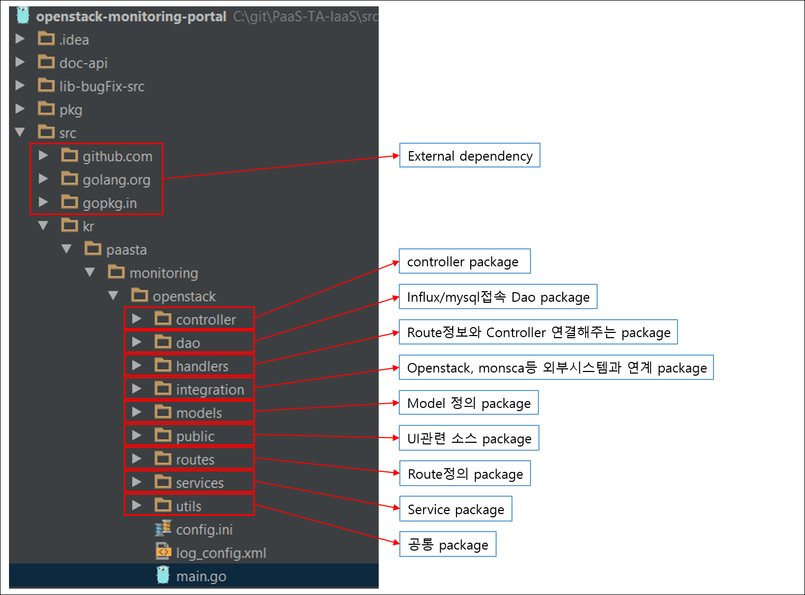

 

##  3.6. IaaS Monitoring Package 간 호출 구조  

> Batch는 30초 단위로 주기적으로 서비스를 호출한다.

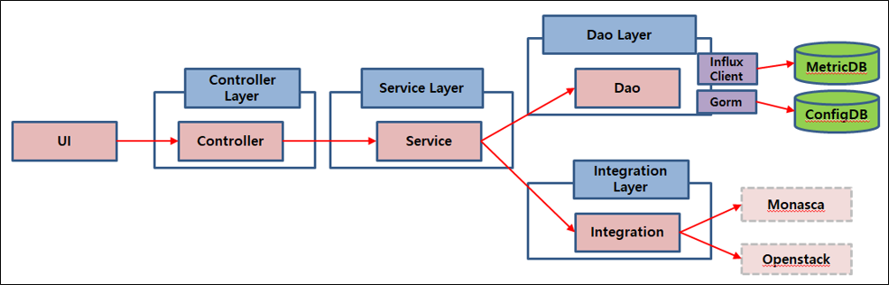

 

##   3.7. IaaS Monitoring 화면 

 

###  3.7.1. Login 화면 

> 로그인 화면으로 Openstack Admin 권한을 가진 사용자의 Id/Pwd를 사용하여 Login 한다.(Openstack 인증)

  

###  3.7.2. Main 화면 

> Main화면에는 Hypervisor 정보와 manage/compute node, Tenant 요약 정보 및 시스템 자원 사용량 정보를 보여준다.
 
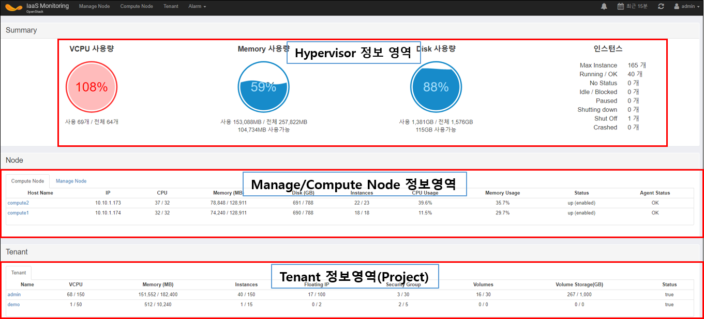

 

###  3.7.3. Manage Node Summary 화면 

> Manage Node에는 Controller/Block/Network Node등이 있다. Manage Node를 선택하면 Node별 Top Process를 볼 수 있다. Controller Node인경우 RabbitMq상태도 조회 가능하다.

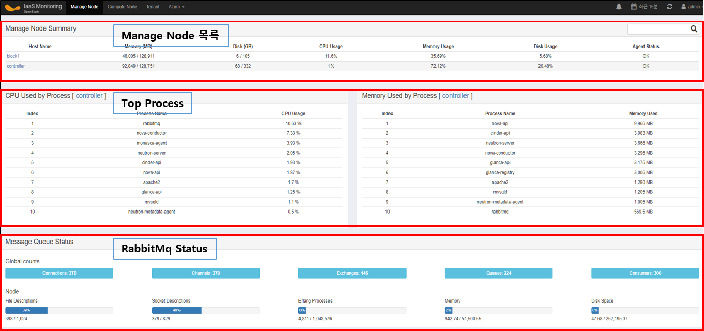

 

###  3.7.4	Manage Node 상세 화면 

> 노드를 클릭하면 상세정보로 이동한다. 상세정보에는 cpu,memory,disk,network정보등을 조회 할 수 있다. 
 
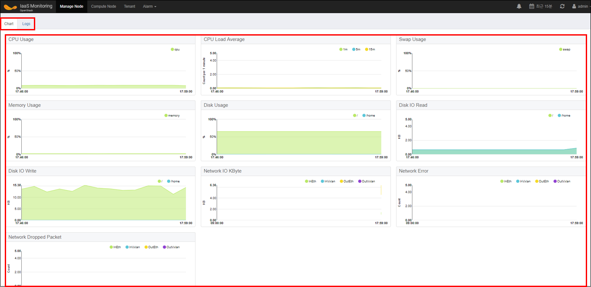

 

> 화면 좌측 상단에 Log Tab을 클릭하면 Node에서 발생한 Log 정보를 조회 할 수 있다.
 
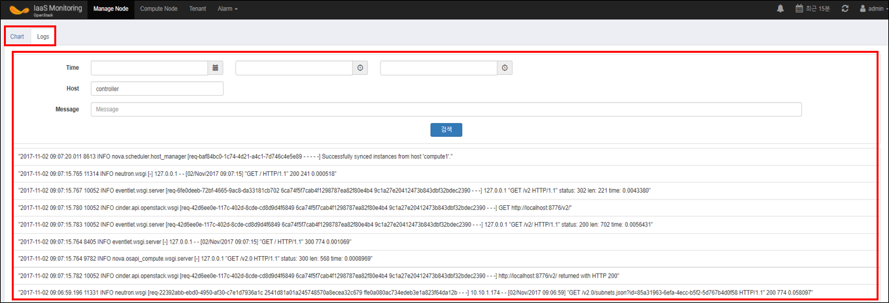

 

###  3.7.5	Compute Node Summary 

> Compute Node를 선택하면 Node별 Top Process를 볼 수 있다. Compute Node의 요약정보 및 시스템 자원 상태도 확인 가능하다.

 
 

###  3.7.6	Tenant Summary 

> 상단 Tenant를 클릭하면 Tenant 요약정보 목록이 나타난다. Tenant목록에는 로그인한 사용자가 권한을 가지고 있는 Tenant만 조회된다. 화면 하단 더보기 버튼을 클릭하면 VM 정보가 추가된다.
 
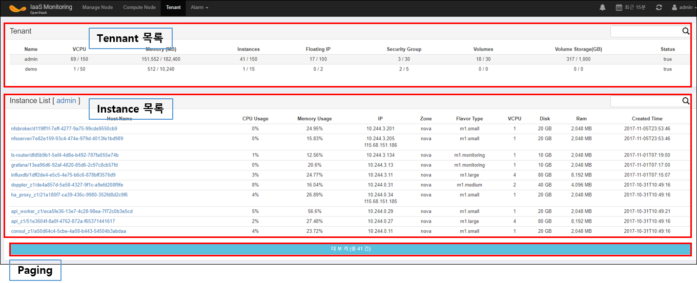

 

###  3.7.7	VM 상세 화면 

> Instance를 클릭하면 상세 화면으로 이동한다.

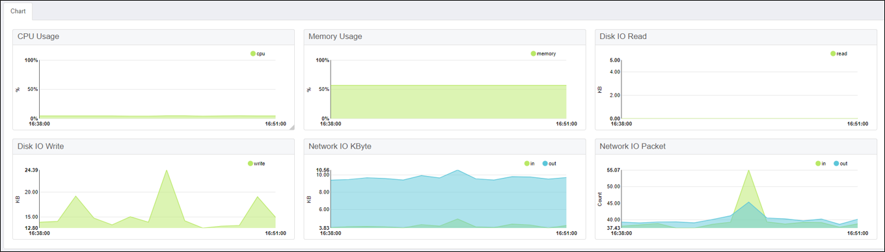

 

###  3.7.8	Alarm Notification 

> 화면 상단 Alarm> Alarm Notification을 클릭하면 화면 하단의 화면이 나타난다.
> Alarm Notification은 Alarm이 발생했을 때 Alarm을 전송받을 Email주소를 입력한다.
 
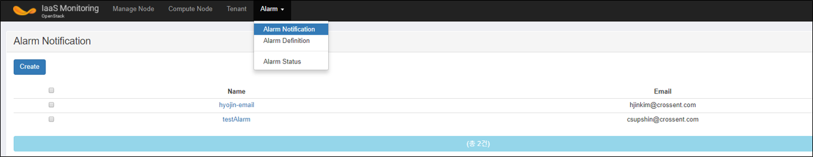 
 
 

###  3.7.9	Alarm Definition 

> 화면 상단 Alarm> Alarm Definition 을 클릭하면 화면 하단의 화면이 나타난다.

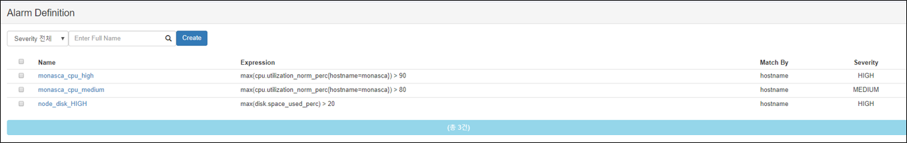 

> Create 버튼을 클릭하면 Alarm 설정화면으로 이동하고 이미 존재하는 Alarm설정을 클릭하면 이미 존재하는 ALarm설정 상세정보를 조회 가능하다.

 

###  3.7.10 Alarm Definition 생성 

> Alarm명 및 심각도 , Alarm설정할 기준을 Expression에서 등록한다. Alarm Receiver에 +버튼을 클릭하여 Notification에 등록한 Alarm 수신자를 설정한다.
 
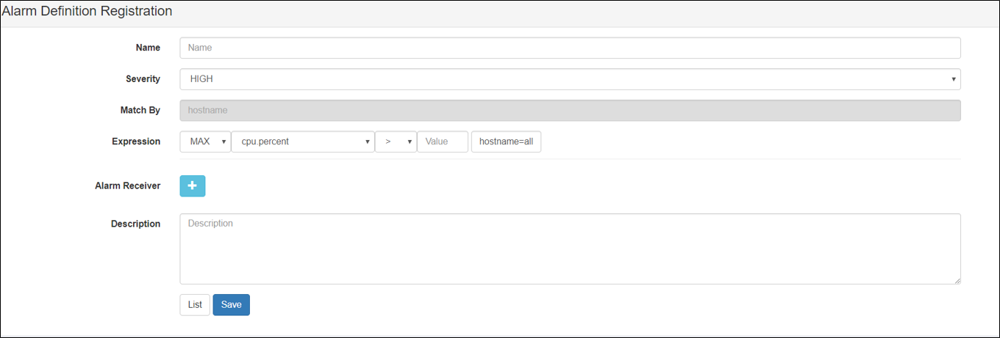

 

###  3.7.11 Alarm Status조회 

> 화면 상단 Alarm> Alarm Status을 클릭하면 화면 하단의 화면이 나타난다.

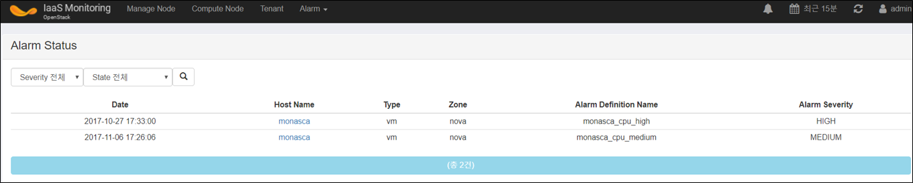

 

> Alarm상세를 클릭하면 하단과 같은 화면이 나타난다. 알람 설정 화면 및 Alarm 발생이력, 조치이력등이 조회 가능하다.

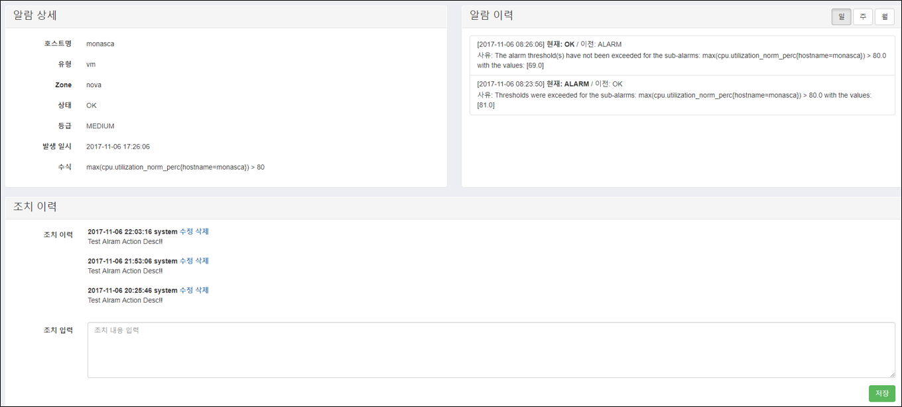