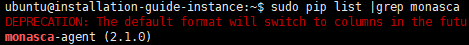

설치가이드_Monasca_Client_v.1.0
===============================

1. [개요](#1)
    * [문서 목적](#2)  
    * [범위](#3)
    * [확인사항](#4)
    * [참고 자료](#5)

2. [Monasca Agent 설치 및 설정](#6)
    * [dependencies 설치](#7)
    * [monasca agent 설치](#8)
    * [설치 확인](#9)
    * [monasca-setup 실행](#10)
        * [Controller Node의 경우](#11)
        * [Rabbit MQ가 설치된 Node의 경우](#12)
        * [Compute Node의 경우 (System 정보 수집과 VM 정보 수집 setup)](#13)
    * [monasca agent configuration 파일 수정](#14)
    * [Monasca Agent 시스템 정보 수집 설정 파일 수정](#15)
        * [/etc/monasca/agent/conf.d/cpu.yaml](#16)
        * [/etc/monasca/agent/conf.d/disk.yaml](#17)
        * [/etc/monasca/agent/conf.d/libvirt.yaml (Compute Node에 한함)](#17)
    * [monasca agent 서비스 재시작](#19)
    * [확인](#20)
            
3. [FileBeat 설치 및 설정](#21)
    * [filebeat repository 등록](#22)
    * [filebeat 설치](#23)
    * [filebeat configuration 파일 수정](#24)
    * [Elasticsearch-Logstash Certificate 파일을 Client 환경에 복사](#25)
    * [/etc/host 파일에 Elasticsearch Server 정보 등록](#26)
    * [filebeat 서비스 재시작](#27)
    * [확인](#28)
        

        
   

#  1. 개요 

## 1.1. 문서목적 

> 본 문서(설치가이드)는, IaaS(Infrastructure as a Service) 중 하나인 Openstack 기반의 Cloud 서비스 상태 및 자원 정보, 그리고 VM Instance의 시스템 정보와 로그정보를 수집하여, 실시간으로 서버로 정보를 전송하기 위한 Agent를 설치하는데 그 목적이 있다.

 

## 1.2. 범위 

> 본 문서의 범위는 Openstack 모니터링을 위한 오픈소스인 Monasca 제품군의 설치를 위한 내용으로 한정되어 있다.

 

## 1.3. 확인사항 

- Openstack 기반 환경 구성에 따라 Agent Setup 설정이 달라짐을 확인한다.
- 크게 Controller Node .와 Compute Node로 구분된다.
- Controller Node에는 Nova, Neutron, Cinder, Glance, Keystone, Swift 서비스가 설치되는 환경이고, Compute Node에는 VM(Instance)이 생성되어 실행되는 환경을 의미한다.

 

## 1.4. 참고사항 

   https://wiki.openstack.org/wiki/Monasca

   https://github.com/openstack/monasca-agent (version 2.1.0)

   https://www.elastic.co/kr/products/beats/filebeat

   

#   2. Monasca Agent 설치 및 설정 

##  2.1. dependencies 설치 

    $ sudo apt-get install python-pip
    $ sudo pip install --upgrade pip

 

##  2.2. monasca agent 설치 

    $ sudo pip install monasca-agent

 

##  2.3. 설치 확인 

    $ sudo pip list | grep monasca-agent
    

 

##  2.4. monasca-setup 실행 

### 2.4.1. Controller Node의 경우 

    $ sudo monasca-setup \
      --username “cross-tenant user id” \
      --password “cross-tenant user password” \
      --project_name “admin project name” \
      --project_id “admin project id” \
      --user_domain_id “domain id” \
      --project_domain_id “domain id” \
      --keystone_url http://“keystone ip”:”keystone auth port”/v3 \
      --monasca_url http://”monasca ip”:”monasca server port”/v2.0 \
      --check_frequency '15'  \
      --log_level 'DEBUG'  \
      --insecure true \
      --system_only 

 

### 2.4.2. Rabbit MQ가 설치된 Node의 경우 

    $ sudo monasca-setup --detection_plugins rabbitmq \
      --detection_args \
      "watch_api=true
      user=”rabbitmq user id”
      password=”rabbitmq user password”
      nodes=rabbit@controller
      queues=conductor
      exchanges=nova,cinder,ceilometer,glance,keystone,neutron,heat"

 

### 2.4.3. Compute Node의 경우 (System 정보 수집과 VM 정보 수집 setup' /> 

    $ sudo monasca-setup \
      --username “cross-tenant user id” \
      --password “cross-tenant user password” \
      --project_name “admin project name” \
      --project_id “admin project id” \
      --user_domain_id “domain id” \
      --project_domain_id “domain id” \
      --keystone_url http://“keystone ip”:”keystone auth port”/v3 \
      --monasca_url http://”monasca ip”:”monasca server port”/v2.0 \
      --check_frequency '15'  \
      --log_level 'DEBUG'  \
      --insecure true \
      --system_only
    
    $ sudo monasca-setup -d libvirt -a 'ping_check=false alive_only=false'
 

##  2.5. monasca agent configuration 파일 수정 

    $ sudo vi /etc/monasca/agent/agent.yml
    ---
    Api:
      amplifier: 0
      backlog_send_rate: 1000
      ca_file: null
      endpoint_type: null
      insecure: true
      keystone_url: http://”keystone ip” :”keystone auth port”/v3
      max_buffer_size: 1000
      max_measurement_buffer_size: -1
      password: cfmonit
      project_domain_id: “domain id”
      project_domain_name: default
      project_id: “admin project id”
      project_name: “admin project name”
      region_name: null
      service_type: null
      url: http:// “monasca server ip”:”monasca server port”/v2.0
      user_domain_id: “domain id”
      user_domain_name: default
      username: monasca-agent
    Logging:
      collector_log_file: /var/log/monasca/agent/collector.log
      enable_logrotate: true
      forwarder_log_file: /var/log/monasca/agent/forwarder.log
      log_level: DEBUG                                            # Log 레벨 설정
      statsd_log_file: /var/log/monasca/agent/statsd.log
    Main:
      check_freq: 15                                              # 수집 주기(초)
      collector_restart_interval: 24
      dimensions: {}
      hostname: controller
      num_collector_threads: 1
      pool_full_max_retries: 4
      sub_collection_warn: 6
    Statsd:
      monasca_statsd_port: 8125

 

##  2.6. Monasca Agent 시스템 정보 수집 설정 파일 수정 

### 2.6.1. /etc/monasca/agent/conf.d/cpu.yaml 

    init_config: null
    instances:
    - built_by: System
      name: cpu_stats
      send_rollup_stats: True    # vcpu measurement Option 추가

 

### 2.6.2. /etc/monasca/agent/conf.d/disk.yaml 

    init_config: null
    instances:
    - built_by: System
      device_blacklist_re: .*freezer_backup_snap.*
      ignore_filesystem_types: iso9660,tmpfs
      name: disk_stats
      send_rollup_stats: True    # Node disk 사용량  Option 추가

 

### 2.6.3. /etc/monasca/agent/conf.d/libvirt.yaml (Compute Node에 한함' /> 

    init_config:
      alive_only: false
      auth_url: http://controller:35357
      cache_dir: /dev/shm
      customer_metadata:
      - scale_group
      disk_collection_period: 0
      max_ping_concurrency: 8
      metadata:
      - scale_group
      nova_refresh: 14400
      password: cfmonit
      ping_check: false
      project_name: admin
      username: admin
      vm_cpu_check_enable: true
      vm_disks_check_enable: true
      vm_extended_disks_check_enable: true   # vm disk 사용량 추가
      vm_network_check_enable: true
      vm_ping_check_enable: true
      vm_probation: 300
      vnic_collection_period: 0
    instances: []

 

##  2.7. monasca agent 서비스 재시작 

    $ sudo service monasca-agent restart

 

##  2.8. 확인 

    # Collect 정보와 Forward 정보를 확인
    $ tail -10f /var/log/monasca/agent/collector.log
    
    $ tail -10f /var/log/monasca/agent/forwarder.log

   

        
#   3. FileBeat 설치 및 설정 

##  3.1. filebeat repository 등록 

    $ echo "deb https://artifacts.elastic.co/packages/5.x/apt stable main" | sudo tee -a     /etc/apt/sources.list.d/elastic-5.x.list
    
    $ sudo apt-get update

 

##  3.2. filebeat 설치 

    
    $ sudo apt-get install -y filebeat

 

##  3.3. filebeat configuration 파일 수정 

    $ sudo vi /etc/filebeat/filebeat.yml
    ---
    ...
    # Add log files 
    paths:
        - /var/log/auth.log                                          # 수집하고자 하는 로그파일을 지정한다.
        - /var/log/syslog                                            # 여러개를 지정할 수 있다.
    # Add document type
    document-type: syslog
    ...
    # Disable Elasticsearch output
    #output.elasticsearch:
      # Array of hosts to connect to.
    #hosts: ["localhost:9200"] 
    ...
    # output.logstash:
      # The Logstash hosts
      hosts: ["elasticsearch server ip:5443"]                        # elasticsearch server ip address
      bulk_max_size: 2048
      ssl.certificate_authorities: ["/etc/filebeat/logstash.crt"]    # logstash certificate file location
      template.name: "filebeat"
      template.path: "filebeat.template.json"
      template.overwrite: false

 

##  3.4. Elasticsearch-Logstash Certificate 파일을 Client 환경에 복사 

    $ sudo scp ubuntu@”elasticsearch server ip”:/etc/logstash/logstash.crt /etc/filebeat/

 

##  3.5. /etc/host 파일에 Elasticsearch Server 정보 등록 

    $ sudo vi /etc/hosts
    ---
    “elasticsearch server ip”    “hostname”
    
    ex) 10.10.10.10  elasticsearch-server

 

##  3.6. filebeat 서비스 재시작 

    
    $ sudo service filebeat restart

 

##  3.7. 확인 

    $ ps -ef |grep filebeat

